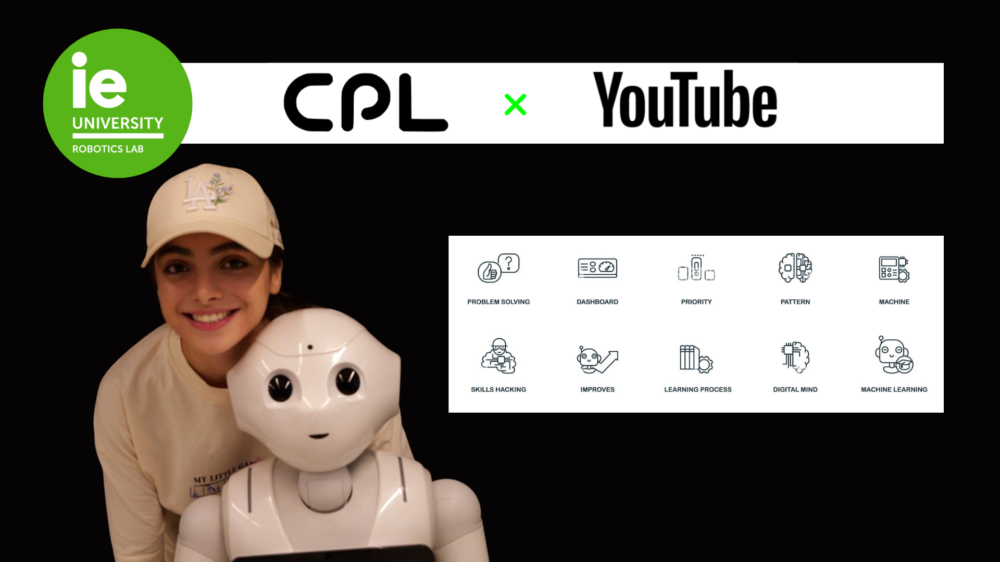

## 💼 Experience

### Real-Estate Market
🔗 [View Project](YOUR-LINK-HERE)

### Accessories
🔗 [View Project](https://andreaisabelmontana.github.io/Alma-De-Maria/)

### Art Gallery
🔗 [View Project](YOUR-LINK-HERE)

### Google Maps Awards
🔗 [View Project](https://andreaisabelmontana.github.io/Google-Maps-Awards-2026)

### Lego
🔗 [View Project](https://andreaisabelmontana.github.io/lego-report)

---

## 🚀 Template Projects

### E-Commerce
🔗 [View Project](https://andreaisabelmontana.github.io/Software-Development-And-Devops/)

### Interactive Resume
🔗 [View Project](https://andreaisabelmontana.github.io/aim-for-the-future.github.io/)

### Machine Learning
🔗 [View Project](https://andreaisabelmontana.github.io) 

## 🛠️ Skills & Tools

### Languages

  

### Frameworks & Libraries

  

### Tools & Platforms

  

### XR / Spatial Computing

  

---

## 🌱 Growth Mindset

- Spatial Computing
- AI Agents & Agentic Systems
- Computer Vision
- Human-Computer Interaction
- WebXR & Immersive Experiences
- Advanced Three.js
